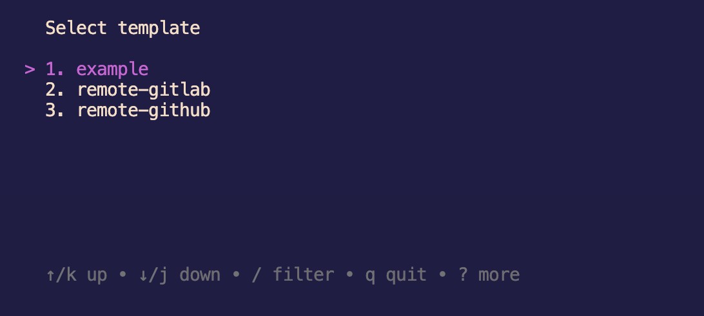

# Usage

The first thing you need to do to use Remaker is register a settings file. This file will contain your template and provider configurations.

```yaml
# This is the list of your providers.
# You can add more providers here.
providers:
    gitlab:
        token: ${GITLAB_TOKEN} # using environment variable, but you can use a plain text token
    github:
        token: ${GITHUB_TOKEN}
# Here is the list of your templates
templates:
    # this is an example template local
    example:
        provider: local
        path: example-template
    # this is a remote template from gitlab
    remote-gitlab:
        provider: gitlab
        url: https://gitlab.com/lbernardo/my-template-golang
    # this is a remote template from github
    remote-github:
        provider: github
        url: https://github.com/lbernardo/my-template-typescript
```

Now run the command to register this file

```bash
$ remaker register my-config-file.yaml
```

> Once registered, you can modify your file as you wish, you will not need to register again.

Now you can run the command to create projects based on templates

```bash
$ remaker create --name myFirstProject --template remote-github
```

It is not mandatory to pass the name and template values, if you do not pass them in the command the remaker will ask you to select them

```bash
$ remaker create --name myFirstProject
```
